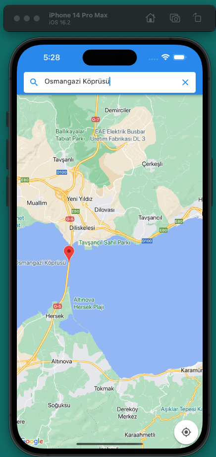
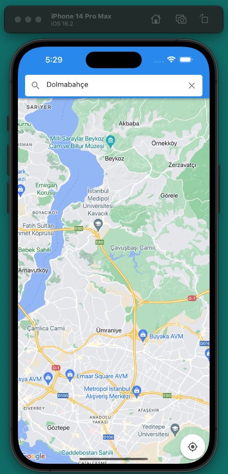
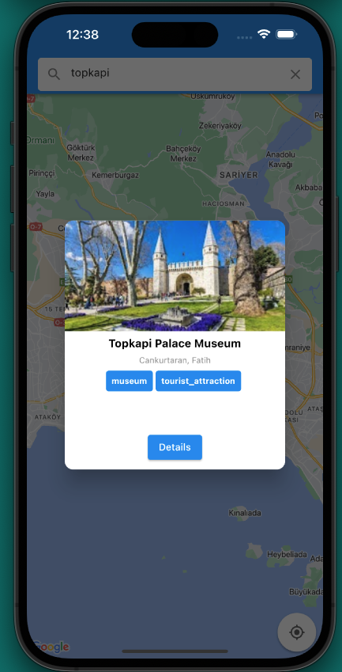
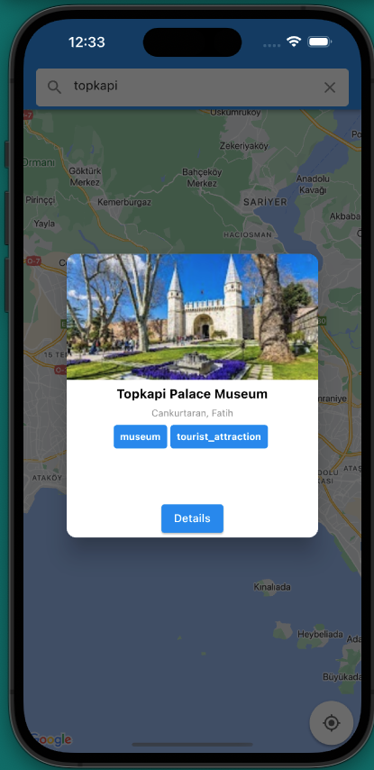

# maps_places

Google Maps Places project

## Screenshots

### Screenshot #1

In this example, "Osmangazi Köprüsü" can be seen on the map. It is a bridge in Bursa, Turkey.

### Screenshot #2

In this example, "Dolmabahçe" query does not give any results. Dolmabahce Palace is a palace in Istanbul, Turkey. For this map position, it is out of the map bounds.  

### Screenshot #3

At this screenshot, you can see pop-up window appears when you click on a marker. It shows the name of the place. 

### Screenshot #4

At this screnshot, you acn see details screen. It shows the name of the place, its address, and its rating.